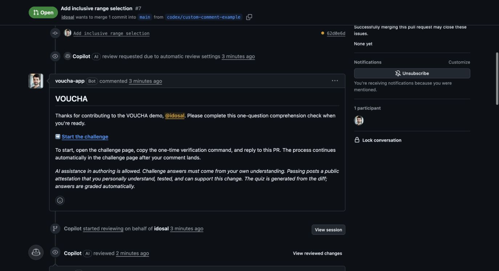
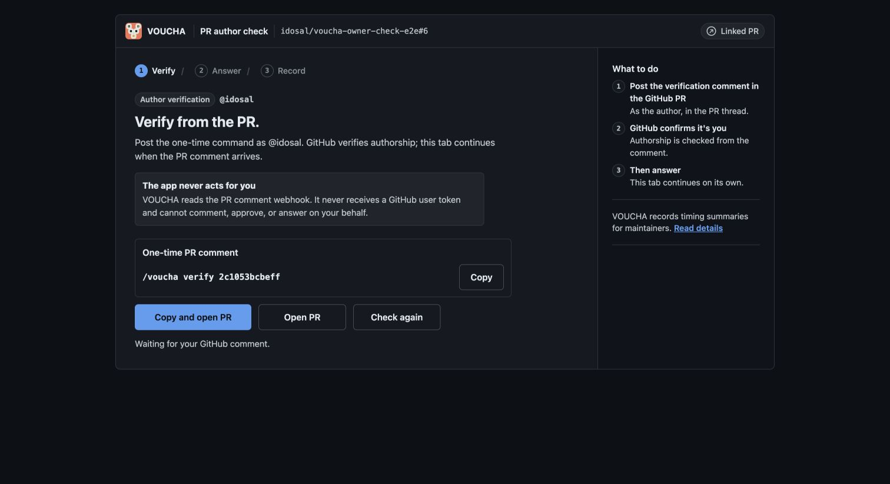

# VOUCHA live demo

This public repository shows the complete VOUCHA workflow on a small,
inspectable pull request: a repository policy selects the PR for a
comprehension check, VOUCHA asks the author to verify from GitHub, and the
author completes a short challenge generated from the actual diff.

**[Open the curated demo PR](https://github.com/idosal/voucha-owner-check-e2e/pull/7)**
· **[Install VOUCHA](https://github.com/apps/voucha-checks/installations/new)**
· **[Product site](https://voucha.dev)**
· **[Documentation](https://voucha.dev/docs/)**



## What this demo proves

- The hosted GitHub App can apply a repository-owned policy to a real PR.
- Owners and maintainers can be challenged when the repository opts into it;
  they are not silently trusted by an external service.
- Author verification happens through a one-time GitHub comment. VOUCHA never
  receives a user token and cannot comment or answer on the author's behalf.
- Questions come from the PR diff, while the resulting check and attestation
  remain visible in the pull-request record.
- AI assistance may be used to author and test the code. Challenge answers must
  come from the PR author's own understanding.

## Walk through the live pull request

1. **Read the change.** [PR #7](https://github.com/idosal/voucha-owner-check-e2e/pull/7)
   adds inclusive range selection to a tiny calculator, together with focused
   Node.js tests.
2. **Inspect the policy.** [`.github/voucha.yml`](.github/voucha.yml) removes
   the normal owner exemption for this demo and sends the PR directly to one
   diff-specific question.
3. **See the GitHub handoff.** The VOUCHA check and managed PR comment link to
   the author-verification page.
4. **Verify authorship.** The PR author posts the displayed one-time command in
   the PR. GitHub's signed webhook establishes who posted it.
5. **Complete the challenge.** The author answers without agent assistance.
   VOUCHA then updates the check and records the outcome on the PR.



## Demo policy

The repository intentionally exercises a stricter path than VOUCHA's normal
defaults:

```yaml
gates:
  - type: multiple_choice
    questions: 1
    pass_threshold: 1

trust:
  default_author_associations: []

require_approval: never
min_changed_lines: 0
skip_paths: []

output:
  contributor_message: >
    Thanks for contributing to the VOUCHA demo, {{author}}. Please complete
    this one-question comprehension check when you're ready.
```

In a normal repository, owners, members, and collaborators are trusted by
default, docs-only and tiny changes can be exempt, and first-time contributors
can require maintainer approval before a challenge is created. Repositories can
also use `output.contributor_message` to match the tone they use with their own
contributors while VOUCHA retains the challenge link and status. See the
[configuration reference](https://voucha.dev/docs/configuration/) for the full
policy model.

## Run the fixture

The demo has no dependencies. Use a supported Node.js release and run:

```bash
npm test
```

The code is intentionally small enough that maintainers can compare every
question with the underlying implementation and tests.
